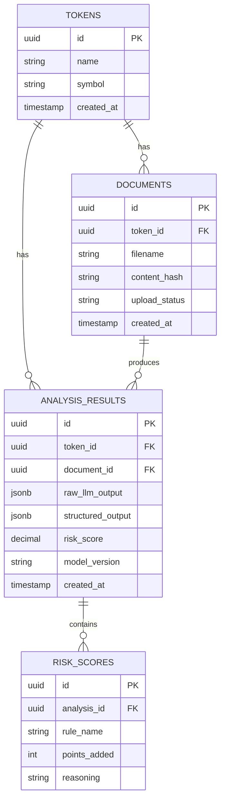
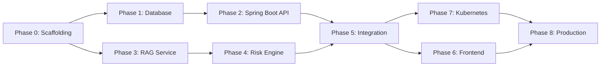

# 🚀 Crypto Intelligence Platform — Implementation Plan

> **Version:** 1.0  
> **Created:** 2026-02-21  
> **Last Updated:** 2026-02-21  
> **Status:** Phase 2 — Not Started 

---

## How to Use This Document

This plan is designed for **incremental, phase-by-phase execution**. Each phase has:

- **Goal** — what we're building and why
- **Deliverables** — concrete outputs
- **Tasks** — ordered checklist (copy into `CURRENT_STATE.md` when starting a phase)
- **Acceptance Criteria** — how we know the phase is done
- **Dependencies** — what must be complete first

> [!TIP]
> When onboarding a new engineer or LLM agent, point them to `CURRENT_STATE.md` for the active phase and this document for the full roadmap.

---

## Architecture Reference

```
                     ┌─────────────────────┐
                     │     Frontend (React) │
                     └──────────┬──────────┘
                                │ HTTP
                                ▼
                  ┌─────────────────────────┐
                  │  Spring Boot API Layer  │
                  │  (Business Logic + Risk)│
                  └──────────┬──────────────┘
                             │ REST (internal)
                             ▼
                ┌───────────────────────────┐
                │ Python RAG Microservice   │
                │ (LangChain + Embeddings)  │
                └──────────┬────────────────┘
                           │
                           ▼
              ┌──────────────────────────────┐
              │ Vector Store (FAISS/Chroma)  │
              └──────────────────────────────┘
                           │
                           ▼
                    LLM Provider (OpenAI)
                           │
                           ▼
                 PostgreSQL (Metadata + Results)
```

---

## Phase 0 — Project Scaffolding & DevOps Foundation

**Goal:** Establish the monorepo structure, development tooling, and CI/CD skeleton so all subsequent work lands cleanly.

**Dependencies:** None (starting point)

### Deliverables

| Deliverable | Path |
|---|---|
| Monorepo directory structure | `/` |
| Root `docker-compose.yml` (dev) | `/docker-compose.yml` |
| Global `.env.example` | `/.env.example` |
| Updated `.gitignore` | `/.gitignore` |
| Makefile / scripts for common tasks | `/Makefile` |

### Tasks

- [ ] Create directory skeleton:
  ```
  /
  ├── api/                  # Spring Boot service
  │   ├── src/
  │   ├── build.gradle (or pom.xml)
  │   └── Dockerfile
  ├── rag-service/          # Python RAG service
  │   ├── app/
  │   ├── requirements.txt
  │   ├── pyproject.toml
  │   └── Dockerfile
  ├── frontend/             # React/Vite SPA (Phase 6)
  ├── k8s/                  # Kubernetes manifests
  ├── docs/                 # This folder
  ├── scripts/              # Utility scripts
  ├── docker-compose.yml
  ├── .env.example
  └── Makefile
  ```
- [ ] Create `.env.example` with all required env vars (placeholder values)
  - `DATABASE_URL`, `POSTGRES_USER`, `POSTGRES_PASSWORD`, `POSTGRES_DB`
  - `OPENAI_API_KEY`
  - `RAG_SERVICE_URL` (for Spring Boot → Python communication)
  - `SPRING_PROFILES_ACTIVE`
- [ ] Update `.gitignore` for Java (`.class`, `build/`, `target/`), Python (`__pycache__`, `.venv`), Docker, IDE, env files
- [ ] Create root `docker-compose.yml` with service stubs:
  - `postgres` — PostgreSQL 16, port 5432, volume mount
  - `api` — Spring Boot placeholder (build from `./api`)
  - `rag-service` — Python placeholder (build from `./rag-service`)
- [ ] Create a `Makefile` with targets: `up`, `down`, `build`, `logs`, `test`, `clean`
- [ ] Verify `docker-compose up` runs without errors (even if services are stubs)

### Acceptance Criteria

- Running `docker-compose up --build` starts all three containers (Postgres is functional, API and RAG are stub/hello-world)
- `.env.example` documents every environment variable the system needs
- Repository structure is clean and follows the skeleton above

---

## Phase 1 — PostgreSQL Database & Schema Design

**Goal:** Design and provision the relational schema that stores token metadata, analysis results, and risk scores.

**Dependencies:** Phase 0

### Deliverables

| Deliverable | Path |
|---|---|
| Database migration scripts | `/api/src/main/resources/db/migration/` |
| Schema documentation | `/docs/SCHEMA.md` |
| Seed/test data script | `/scripts/seed_db.sql` |

### Tasks

- [ ] Design core tables:
  - `tokens` — id (UUID), name, symbol, created_at, updated_at
  - `documents` — id, token_id (FK), filename, content_hash, upload_status, created_at
  - `analysis_results` — id, token_id (FK), document_id (FK), raw_llm_output (JSONB), structured_output (JSONB), risk_score (DECIMAL), model_version, created_at
  - `risk_scores` — id, analysis_id (FK), rule_name, points_added, reasoning
- [ ] Write Flyway (or Liquibase) migration scripts (V1, V2, etc.)
- [ ] Create `/docs/SCHEMA.md` with ER diagram (Mermaid) and field descriptions
- [ ] Create seed script with 2–3 example tokens for development
- [ ] Verify migrations run on `docker-compose up` (Flyway auto-migration in Spring Boot)
- [ ] Add database health check to `docker-compose.yml`

### Acceptance Criteria

- `docker-compose up` creates all tables automatically
- Seed data is loadable via `make seed`
- `SCHEMA.md` is current and matches the running database

### Schema (Mermaid ER Preview)



---

## Phase 2 — Spring Boot API Service (Core)

**Goal:** Build the Java/Spring Boot REST API that handles document uploads, communicates with the RAG service, persists results, and exposes query endpoints.

**Dependencies:** Phase 1

### Deliverables

| Deliverable | Path |
|---|---|
| Spring Boot project | `/api/` |
| Dockerfile (multi-stage) | `/api/Dockerfile` |
| REST endpoints | see below |
| JPA entities & repositories | `/api/src/main/java/.../` |
| Integration tests | `/api/src/test/` |

### Tasks

- [ ] Initialize Spring Boot project (Gradle or Maven) with dependencies:
  - `spring-boot-starter-web`
  - `spring-boot-starter-data-jpa`
  - `spring-boot-starter-validation`
  - `spring-boot-starter-actuator`
  - `postgresql` driver
  - `flyway-core`
- [ ] Create JPA entities mapping to Phase 1 schema:
  - `Token`, `Document`, `AnalysisResult`, `RiskScore`
- [ ] Create Spring Data JPA repositories
- [ ] Implement REST endpoints:
  | Method | Path | Description |
  |---|---|---|
  | `POST` | `/api/v1/tokens` | Create/register a token |
  | `POST` | `/api/v1/tokens/{id}/documents` | Upload a whitepaper (multipart) |
  | `GET` | `/api/v1/tokens/{id}` | Get token with latest analysis |
  | `GET` | `/api/v1/tokens` | List all tokens |
  | `GET` | `/api/v1/tokens/{id}/analysis` | Get full analysis history |
  | `GET` | `/api/v1/compare?ids=X,Y,Z` | Compare multiple tokens |
  | `GET` | `/actuator/health` | Health check |
- [ ] Implement `RagServiceClient` — REST client (WebClient or RestTemplate) that calls the Python RAG service
- [ ] Add request validation (Bean Validation annotations)
- [ ] Add global exception handler (`@ControllerAdvice`)
- [ ] Write multi-stage Dockerfile:
  - Stage 1: Gradle/Maven build
  - Stage 2: JRE runtime (eclipse-temurin)
- [ ] Add unit tests for service layer
- [ ] Add integration tests using Testcontainers (PostgreSQL)
- [ ] Verify health endpoint returns 200

### Acceptance Criteria

- All endpoints return correct responses (Postman / curl)
- `POST /documents` accepts a file upload and stores metadata
- Health check at `/actuator/health` returns `UP`
- Tests pass in CI-equivalent (`make test-api`)
- Container builds and runs in Docker Compose

### API Error Response Format

```json
{
  "timestamp": "2026-02-21T19:00:00Z",
  "status": 400,
  "error": "Bad Request",
  "message": "Token name is required",
  "path": "/api/v1/tokens"
}
```

---

## Phase 3 — Python RAG Service (Core)

**Goal:** Build the Python microservice that ingests documents, generates embeddings, stores vectors, queries the LLM, and returns structured tokenomics data.

**Dependencies:** Phase 0 (can be built in parallel with Phase 2)

### Deliverables

| Deliverable | Path |
|---|---|
| FastAPI application | `/rag-service/app/` |
| LangChain pipeline | `/rag-service/app/pipeline/` |
| Pydantic schemas | `/rag-service/app/schemas/` |
| Dockerfile | `/rag-service/Dockerfile` |
| Unit + integration tests | `/rag-service/tests/` |

### Tasks

- [ ] Initialize Python project:
  - `pyproject.toml` or `requirements.txt`
  - Dependencies: `fastapi`, `uvicorn`, `langchain`, `langchain-openai`, `langchain-community`, `faiss-cpu` (or `chromadb`), `pydantic`, `python-multipart`, `httpx`, `pytest`
- [ ] Define Pydantic output schema:
  ```python
  class TokenomicsOutput(BaseModel):
      token_name: str
      total_supply: str
      inflation_rate: str
      vesting_schedule_summary: str
      staking_rewards: str
      utility_description: str
      governance_model: str
      deflationary: bool
      identified_risks: list[str]
      computed_risk_score: float  # placeholder, overwritten by risk engine
  ```
- [ ] Implement document processing pipeline:
  1. **Ingest** — accept PDF/text, extract raw text
  2. **Chunk** — split into overlapping chunks (RecursiveCharacterTextSplitter)
  3. **Embed** — generate embeddings (OpenAI `text-embedding-3-small`)
  4. **Store** — persist in FAISS (file-backed) or Chroma
  5. **Retrieve** — similarity search for relevant chunks
  6. **Extract** — LLM call with structured output prompt + Pydantic validation
- [ ] Implement FastAPI endpoints:
  | Method | Path | Description |
  |---|---|---|
  | `POST` | `/api/v1/analyze` | Accept document, return structured analysis |
  | `GET` | `/health` | Health check |
  | `GET` | `/api/v1/status/{job_id}` | (Optional) async job status |
- [ ] Create prompt template for tokenomics extraction (system + user prompt)
- [ ] Add retry logic and timeout handling for LLM calls
- [ ] Add structured output validation (Pydantic parse + retry on failure)
- [ ] Write Dockerfile:
  - Base image: `python:3.12-slim`
  - Install deps, copy source, run with `uvicorn`
- [ ] Write unit tests:
  - Schema validation tests
  - Chunking logic tests
  - Mock LLM response tests
- [ ] Write integration test with a sample whitepaper

### Acceptance Criteria

- `POST /api/v1/analyze` with a sample PDF returns valid `TokenomicsOutput` JSON
- Health check returns 200
- All Pydantic validations pass (no unstructured LLM output leaks through)
- Container builds and runs in Docker Compose
- FAISS index is persisted to a volume (survives restart)

### Prompt Engineering Notes

The extraction prompt should:
1. Provide the Pydantic schema as the expected JSON format
2. Instruct the LLM to fill every field or explicitly state "not found"
3. Include few-shot examples of good extractions
4. Use a system prompt establishing the LLM as a tokenomics analyst

---

## Phase 4 — Risk Scoring Engine

**Goal:** Implement the deterministic rule-based risk scoring layer that post-processes LLM-extracted tokenomics into a normalized risk score.

**Dependencies:** Phase 3 (needs `TokenomicsOutput` schema)

### Deliverables

| Deliverable | Path |
|---|---|
| Risk engine module (can live in API or RAG service) | `/api/src/.../risk/` or `/rag-service/app/risk/` |
| Rule definitions (configurable) | `/config/risk_rules.yaml` |
| Risk scoring documentation | `/docs/RISK_SCORING.md` |

### Tasks

- [ ] Decide placement: risk engine in Spring Boot (Java) or Python service
  - **Recommendation:** Java (Spring Boot) — keeps deterministic logic in the business layer, separate from AI inference
- [ ] Define risk rule schema (YAML-driven for easy tuning):
  ```yaml
  rules:
    - name: high_inflation
      field: inflation_rate
      condition: "> 10%"
      points: 2
      reasoning: "Inflation rate exceeds 10%"
    - name: major_unlock_soon
      field: vesting_schedule_summary
      condition: "contains 'within 6 months'"
      points: 3
      reasoning: "Major token unlock within 6 months"
    - name: no_governance
      field: governance_model
      condition: "empty or 'not found'"
      points: 1
      reasoning: "No governance transparency"
    - name: unlimited_supply
      field: total_supply
      condition: "contains 'unlimited'"
      points: 3
      reasoning: "Unlimited token supply"
  ```
- [ ] Implement `RiskScoringService`:
  - Load rules from YAML
  - Evaluate each rule against `TokenomicsOutput`
  - Sum points → raw score
  - Normalize to 0-100 scale
  - Return score + per-rule breakdown
- [ ] Persist per-rule results in `risk_scores` table
- [ ] Add API endpoint or integrate into analysis flow:
  - After RAG returns `TokenomicsOutput`, risk engine scores it
  - Final `AnalysisResult` includes both LLM output and risk score
- [ ] Write comprehensive unit tests for each rule
- [ ] Write edge case tests (missing fields, ambiguous values)
- [ ] Document scoring methodology in `/docs/RISK_SCORING.md`

### Acceptance Criteria

- Given a `TokenomicsOutput` with known values, risk score is deterministic and reproducible
- Score breakdown shows which rules triggered and why
- Adding/removing rules via YAML config changes scoring without code changes
- All rule unit tests pass

---

## Phase 5 — End-to-End Integration & Testing

**Goal:** Wire Spring Boot ↔ RAG service communication, validate the full upload-to-analysis pipeline, and harden error handling.

**Dependencies:** Phases 2, 3, 4

### Deliverables

| Deliverable | Path |
|---|---|
| Updated `docker-compose.yml` | `/docker-compose.yml` |
| E2E test suite | `/tests/e2e/` |
| Sample whitepapers for testing | `/tests/fixtures/` |
| API documentation (OpenAPI) | auto-generated |

### Tasks

- [ ] Wire `RagServiceClient` in Spring Boot to call Python service
  - Configure URL via `RAG_SERVICE_URL` env var
  - Add circuit breaker (Resilience4j) for fault tolerance
  - Add timeout configuration (30s default for LLM calls)
- [ ] Implement the full pipeline:
  1. `POST /api/v1/tokens/{id}/documents` → saves document metadata
  2. Spring Boot sends document content to `POST /rag-service/api/v1/analyze`
  3. RAG service returns `TokenomicsOutput`
  4. Spring Boot applies risk scoring
  5. Combined result persisted in `analysis_results`
  6. Response returned to client
- [ ] Add async processing option (Phase 5.5 — optional):
  - Return `202 Accepted` with job ID
  - Client polls `GET /api/v1/tokens/{id}/analysis/{analysisId}/status`
- [ ] Collect 3–5 real crypto whitepapers as test fixtures (e.g., Ethereum, Solana, Uniswap)
- [ ] Write E2E test scripts:
  - Upload whitepaper → verify analysis created
  - Compare two tokens → verify comparison response
  - Upload invalid file → verify error response
  - RAG service down → verify graceful degradation
- [ ] Generate OpenAPI docs (Spring Boot `springdoc-openapi` or `Swagger`)
- [ ] Performance test: single analysis should complete within 60 seconds
- [ ] Add request/response logging (structured JSON logs)
- [ ] Add correlation ID header (`X-Request-ID`) across services

### Acceptance Criteria

- Full pipeline works end-to-end via `docker-compose up`
- Uploading a real whitepaper produces a valid, scored analysis
- Token comparison endpoint returns side-by-side results
- Error scenarios are handled gracefully (RAG down, invalid file, LLM timeout)
- OpenAPI docs are accessible at `/swagger-ui.html`
- All E2E tests pass

---

## Phase 6 — Frontend (React SPA)

**Goal:** Build a clean, functional web UI for uploading documents, viewing analysis results, and comparing tokens.

**Dependencies:** Phase 5

### Deliverables

| Deliverable | Path |
|---|---|
| React/Vite project | `/frontend/` |
| Dockerfile | `/frontend/Dockerfile` |
| Core pages | see below |

### Tasks

- [ ] Initialize Vite + React project in `/frontend/`
- [ ] Set up project structure:
  ```
  /frontend/
  ├── src/
  │   ├── components/
  │   ├── pages/
  │   ├── services/    # API client
  │   ├── hooks/
  │   └── styles/
  ├── public/
  ├── Dockerfile
  └── vite.config.ts
  ```
- [ ] Implement pages:
  | Page | Route | Description |
  |---|---|---|
  | Dashboard | `/` | Overview of all tokens + latest risk scores |
  | Token Detail | `/tokens/:id` | Full analysis, risk breakdown, document history |
  | Upload | `/upload` | Drag-and-drop whitepaper upload |
  | Compare | `/compare` | Side-by-side token comparison |
- [ ] Build core components:
  - `RiskScoreGauge` — visual risk score indicator (0-100)
  - `TokenCard` — summary card for dashboard
  - `AnalysisTimeline` — history of analyses for a token
  - `ComparisonTable` — side-by-side metrics
  - `FileUpload` — drag-and-drop with progress
- [ ] Implement API service layer (Axios/Fetch wrapper)
- [ ] Add loading states, error states, empty states
- [ ] Responsive layout (mobile-friendly)
- [ ] Create multi-stage Dockerfile:
  - Stage 1: `npm run build`
  - Stage 2: Nginx to serve static assets + reverse proxy to API
- [ ] Add to `docker-compose.yml`

### Acceptance Criteria

- Dashboard shows all tokens with risk scores
- Upload flow works end-to-end (file → analysis → results displayed)
- Comparison page shows side-by-side metrics
- UI is responsive and visually polished
- Container builds and serves via Nginx

---

## Phase 7 — Kubernetes Deployment

**Goal:** Package all services for production-grade Kubernetes deployment with proper resource management, scaling, and observability.

**Dependencies:** Phase 5 (Phase 6 is optional for K8s)

### Deliverables

| Deliverable | Path |
|---|---|
| K8s manifests | `/k8s/` |
| Helm chart (optional) | `/k8s/helm/` |
| Deployment documentation | `/docs/DEPLOYMENT.md` |

### Tasks

- [ ] Create Kubernetes manifests:
  ```
  /k8s/
  ├── namespace.yaml
  ├── postgres/
  │   ├── deployment.yaml
  │   ├── service.yaml
  │   ├── pvc.yaml
  │   └── configmap.yaml
  ├── api/
  │   ├── deployment.yaml
  │   ├── service.yaml
  │   └── configmap.yaml
  ├── rag-service/
  │   ├── deployment.yaml
  │   ├── service.yaml
  │   ├── hpa.yaml         # Horizontal Pod Autoscaler
  │   └── configmap.yaml
  ├── frontend/
  │   ├── deployment.yaml
  │   └── service.yaml
  └── secrets.yaml          # (template, not committed)
  ```
- [ ] Configure resource requests/limits:
  - API: 256Mi–512Mi RAM, 0.25–0.5 CPU
  - RAG service: 512Mi–1Gi RAM, 0.5–1 CPU
  - PostgreSQL: 256Mi–512Mi RAM, 0.25 CPU
- [ ] Set up Horizontal Pod Autoscaler for RAG service:
  - Scale on CPU utilization (target 70%)
  - Min 1, Max 5 replicas
- [ ] Create Secrets template for sensitive config (API keys, DB credentials)
- [ ] Add liveness and readiness probes for all services
- [ ] Add NetworkPolicy for service isolation (optional)
- [ ] Write `/docs/DEPLOYMENT.md` with step-by-step deploy instructions
- [ ] Test full deployment on local cluster (minikube / kind)

### Acceptance Criteria

- `kubectl apply -f k8s/` deploys all services successfully
- All pods reach `Running` state
- HPA scales RAG service under load
- Services communicate via ClusterIP services
- Health probes pass

---

## Phase 8 — Productionization & Future Enhancements

**Goal:** Harden for production and implement planned enhancements from the README.

**Dependencies:** Phase 7

### Tasks (prioritized backlog)

| Priority | Enhancement | Complexity |
|---|---|---|
| P0 | CI/CD pipeline (GitHub Actions) — build, test, push images | Medium |
| P0 | Authentication & user roles (Spring Security + JWT) | Medium |
| P1 | Redis caching layer (cache analysis results, rate limiting) | Low |
| P1 | Live market data integration (CoinGecko API) | Medium |
| P2 | Async task queue (Kafka/RabbitMQ for long-running analyses) | High |
| P2 | Fully diluted valuation calculations | Medium |
| P2 | Historical unlock tracking | Medium |
| P3 | Monitoring stack (Prometheus + Grafana) | Medium |
| P3 | Centralized logging (ELK or Loki) | Medium |

### CI/CD Pipeline (P0 detail)

```yaml
# .github/workflows/ci.yml outline
name: CI
on: [push, pull_request]
jobs:
  api-tests:
    - Checkout → Setup JDK → Gradle test
  rag-tests:
    - Checkout → Setup Python → pip install → pytest
  build-images:
    - Build Docker images for api, rag-service, frontend
  push-images:
    - Push to GHCR (on main branch only)
  deploy:
    - kubectl apply (on main branch, staging namespace)
```

---

## Phase Dependency Graph



---

## Estimated Timeline (Solo Developer)

| Phase | Estimated Duration | Parallelizable With |
|---|---|---|
| Phase 0 | 1 day | — |
| Phase 1 | 1 day | — |
| Phase 2 | 3–4 days | Phase 3 |
| Phase 3 | 3–4 days | Phase 2 |
| Phase 4 | 1–2 days | — |
| Phase 5 | 2–3 days | — |
| Phase 6 | 3–4 days | Phase 7 |
| Phase 7 | 2–3 days | Phase 6 |
| Phase 8 | Ongoing | — |
| **Total** | **~3–4 weeks** | |

---

## Conventions & Standards

### Git Workflow

- **Branch naming:** `phase-X/description` (e.g., `phase-2/spring-boot-api`)
- **Commit format:** `[Phase X] <type>: <description>` (e.g., `[Phase 2] feat: add token entity and repository`)
- **Types:** `feat`, `fix`, `docs`, `test`, `refactor`, `chore`

### Code Standards

- **Java:** Google Java Style Guide, Checkstyle enforced
- **Python:** Black formatter, Ruff linter, type hints required
- **Both:** All public methods documented, all endpoints tested

### Environment Management

- All config via environment variables (12-factor)
- `.env.example` is the source of truth for required vars
- Never commit secrets — use `.env` (gitignored) or K8s Secrets
