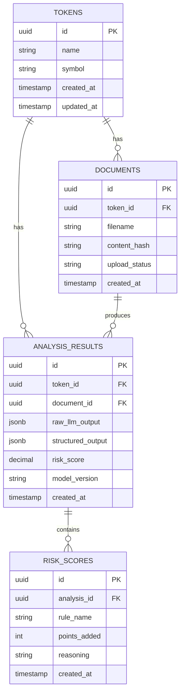

# Database Schema — Crypto Intelligence Platform

This document describes the relational database schema used to store token metadata, whitepaper analysis results, and risk scores.

## Entity Relationship Diagram

## Table Definitions

### `tokens`
Stores the high-level information for each crypto token analyzed by the platform.

| Column | Type | Description |
|---|---|---|
| `id` | UUID | Primary key. |
| `name` | VARCHAR | Full name of the token (e.g., "Ethereum"). |
| `symbol` | VARCHAR | Ticker symbol (e.g., "ETH"). |
| `created_at` | TIMESTAMP | Creation timestamp. |
| `updated_at` | TIMESTAMP | Last update timestamp. |

### `documents`
Stores metadata for whitepapers or other documents uploaded for analysis.

| Column | Type | Description |
|---|---|---|
| `id` | UUID | Primary key. |
| `token_id` | UUID | Foreign key to `tokens`. |
| `filename` | VARCHAR | Original filename. |
| `content_hash` | VARCHAR | SHA-256 hash of the content to prevent duplicates. |
| `upload_status` | VARCHAR | Status of the upload (e.g., PENDING, PROCESSED). |
| `created_at` | TIMESTAMP | Upload timestamp. |

### `analysis_results`
Stores the structured output from the RAG service and the aggregate risk score.

| Column | Type | Description |
|---|---|---|
| `id` | UUID | Primary key. |
| `token_id` | UUID | Foreign key to `tokens`. |
| `document_id` | UUID | Foreign key to `documents`. |
| `raw_llm_output` | JSONB | The raw JSON string returned by the LLM. |
| `structured_output` | JSONB | Post-processed/validated JSON output. |
| `risk_score` | DECIMAL | Aggregate risk score calculated by the platform (0-100). |
| `model_version` | VARCHAR | Version of the LLM/RAG pipeline used. |
| `created_at` | TIMESTAMP | Analysis timestamp. |

### `risk_scores`
Stores per-rule breakdown of the risk score for transparency and auditability.

| Column | Type | Description |
|---|---|---|
| `id` | UUID | Primary key. |
| `analysis_id` | UUID | Foreign key to `analysis_results`. |
| `rule_name` | VARCHAR | Name of the risk rule triggered. |
| `points_added` | INTEGER | Points added to the raw risk score by this rule. |
| `reasoning` | TEXT | Explanation of why the rule was triggered. |
| `created_at` | TIMESTAMP | Score calculation timestamp. |
